<div align="center">

[](https://git.io/typing-svg)

<br>

<a href="https://seojuwon.com"></a>
<a href="https://github.com/4ndrxxs"></a>


</div>

<br>

##  &nbsp;About Me

```python
class JuwonSeo:
    def __init__(self):
        self.name = "Juwon Seo"
        self.school = "Gyeonggi Buk Science High School"
        self.role = "AI Engineer × Creative Developer"
        self.portfolio = "https://seojuwon.com"

    @property
    def achievements(self):
        return [
            "🏆 Ministry of Science and ICT Award ×2",
            "🤖 Google AI Professional Certificate",
            "🎓 Gyeonggi Buk Science High School Student",
        ]

    @property
    def interests(self):
        return [
            "Artificial Intelligence & Deep Learning",
            "Web × AI Integration",
            "Cryptography & Security",
            "Mathematical Modeling",
        ]
```

---

## 🧠 AI & Machine Learning

<div align="center">

<table>
<tr>
<td align="center" width="33%">

**🔬 Research**
<br><br>
Deep Learning<br>
Mathematical Modeling<br>
Stock Price Prediction (NSPPM)<br>
Gradient Descent Optimization

</td>
<td align="center" width="33%">

**🤖 Certifications**
<br><br>
Google AI Professional<br>
AI Fundamentals<br>
AI for Data Analysis<br>
AI for App Building

</td>
<td align="center" width="33%">

**🏆 Awards**
<br><br>
Ministry of Science and ICT<br>
Minister Award ×2<br>
<br>


</td>
</tr>
</table>

</div>

---

## ⚡ Tech Stack

<div align="center">

**🧠 AI / ML**

<a href="https://skillicons.dev">

</a>

**🌐 Frontend**

<a href="https://skillicons.dev">

</a>

**⚙️ Backend & Tools**

<a href="https://skillicons.dev">

</a>

</div>

---

## 📊 GitHub Stats

<div align="center">




<br>


</div>

---

## 🐍 Contribution Snake

<picture>
  <source media="(prefers-color-scheme: dark)" srcset="https://raw.githubusercontent.com/4ndrxxs/4ndrxxs/output/github-snake-dark.svg" />
  <source media="(prefers-color-scheme: light)" srcset="https://raw.githubusercontent.com/4ndrxxs/4ndrxxs/output/github-snake.svg" />
  
</picture>

---

## 🏗️ Featured Projects

<div align="center">

| Project | Description | Tech |
|:-------:|:-----------:|:----:|
| [**seojuwon.com**](https://github.com/4ndrxxs/seojuwon) | Cinematic personal portfolio with shooting stars & parallax |   |
| [**wavecrypt**](https://github.com/4ndrxxs/wavecrypt) | Geo-Locked Identity Generation from Wave Entropy |  |
| [**HBscore**](https://github.com/4ndrxxs/HBscore) | Premium Academy Score Management System |   |
| [**Deep Learning**](https://github.com/4ndrxxs/GBS-Gradient_descent_and_Deep_Learning) | Gradient Descent & Deep Learning Research |  |
| [**TessellationGrid**](https://github.com/4ndrxxs/TessellationGrid) | Tessellation Visualization for Research |  |
| [**NSPPM**](https://github.com/4ndrxxs/RNE-NSPPM) | New Stock Price Prediction Model | 📊 Math Modeling |

</div>

---

<div align="center">


</div>
